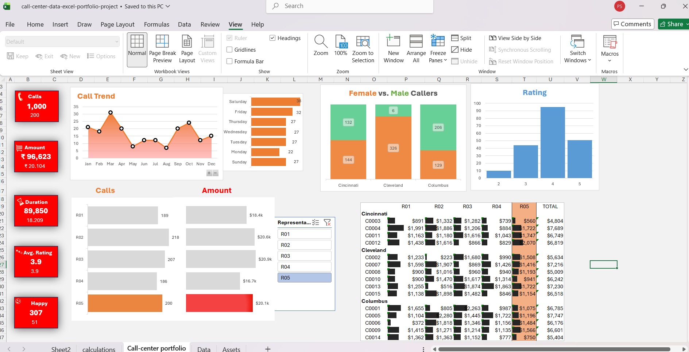

# Call Center Performance Analysis – Excel Dashboard

## 📌 Project Overview
This project analyzes call center data using Microsoft Excel.
An interactive dashboard was created to track call volume, revenue,
customer ratings, and call trends.

## 📊 Dashboard Preview

(dashboard_preview(1).png.png)

## 🛠 Tools & Skills Used
- Microsoft Excel
- Pivot Tables & Pivot Charts
- Slicers & Filters
- Conditional Formatting
- KPI Dashboards

## 🔍 Key Analysis
- Monthly call trends
- Gender-wise caller distribution
- Call duration and revenue analysis
- Customer satisfaction based on ratings

## 🎯 Outcome
Provided actionable insights through an interactive Excel dashboard
to support data-driven decision making.
